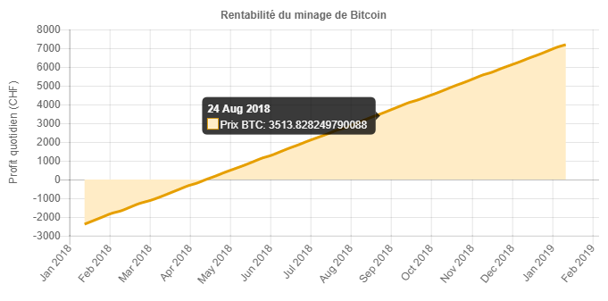

# Rentabilité du minage de Bitcoin

Ce projet de Visualisation d'Information tente d'analyser la rentabilité du minage du Bitcoin.

## Introduction

Dans le cadre du cours de visualisation de l'information, il nous a été demandé de proposer et de développer un projet de visualisation.

Pour notre projet, nous avons choisi de travailler avec les monnaies virtuelles, qui est un sujet très actuel. Plus précisément, en raison de la difficulté à trouver des informations sur le minage, nous avons choisi de centrer notre projet sur celui-ci. Notre projet consiste alors à étudier la rentabilité du minage du Bitcoin, et de présenter ces résultats à un public d'amateurs, qui s'intéressent ou désirent se lancer dans le minage de monnaies virtuelles.

## Comment lancer l'application

Étant donné que l'application tourne avec HTML, CSS et Javascript, Vous pouvez simplement ouvrir `app.html` en local, ou le lien ci-dessous en ligne :

http://htmlpreview.github.io/?https://github.com/fakocher/cryptocurrency-mining-profitability/blob/master/app.html

## Choix des données

Nous avons besoin de plusieurs données pour notre projet. Nous n'avons pas pu trouver un endroit unique ou trouver ces données, et avons donc du les récupérer de site différents. Le but initial était d'obtenir les données en temps réel, mais pour des raisons de temps et de simplicité, 
les valeurs historiques ont été chargées de manière statique et sauvées dans un fichier javascript.

### prix actuel du bitcoin

Provenance : https://www.cryptocompare.com/api/

Nous obtenons directement la dernière valeur du marché depuis une API.

### données historiques sur la difficulté

Provenance : https://blockchain.info/fr/charts/difficulty

Ces données sont nécessaire pour estimer des courbes de tendance, qui sont utilisées par notre application pour calculer la rentabilité du minage. Nous avons pour cela déterminer 2 modèles de courbe qui semblait pouvoir suivre la tendance, une courbe polynomiale d'ordre 5, et une courbe exponentielle.

Les données remontent au lancement du bitcoin, jusque au moment du téléchargement. Pour améliorer notre application, il serait bien d'obtenir ces valeurs en temps réel. Cela nécessite par contre de pouvoir calculer les courbes de tendances à l'aide d'un algorithme, ce qui n'a pas été fait dans notre cas. Notre set contient 1636 points de données, un point chaque deux jours.

### données historiques sur le prix du marché

Provenance : https://blockchain.info/fr/charts/market-price

Comme pour les données sur la difficulté, ces données sont aussi utilisées pour calculer les courbes de tendances. Nous avons de nouveau utilisé des courbes de tendances polynomiale et exponentielle, mais nous avons aussi ajouté une courbe linéaire. En effet, la courbe a énormément augmenté récemment suite à pic de popularité des monnaies virtuelles. La valeur du Bitcoin donc l'impression d'augmenter de manière exponentielle à ce jour, mais il paraît peu probable qu'elle continue ainsi.

Les données remontent aussi au lancement du Bitcoin, jusqu'au moment du téléchargement, et le set contient lui aussi 1636 points de données, un point chaque deux jours

### Données de rentabilité créées

Nous avons calculé la rentabilité du minage et avons visualisé ces données (Rentabilité/Date).

### processeurs dédiés

Provenance : https://en.bitcoin.it/wiki/Mining_hardware_comparison

Nous avons choisi quelques processeurs dédiés au minage et extrait leurs caractéristiques.

### prix de l'électricité

Provenance : http://www.romande-energie.ch/images/Files/prix-electricite/2017_prix-electricite_RE.pdf

Cette valeur a été choisie selon le prix actuel.

## Intentions, message à transmettre

Le but principal du projet est de montrer la rentabilité du minage des monnaies virtuelles sur le long terme. 

Ceci est une question très actuelle, du à l'augmentation de la popularité des monnaies virtuelles. Nous avons trouvé énormément de sites internet qui parlent de la valeur du Bitcoin, mais très peu parlent du minage qui reste une activité d'initié.

Nos résultats sont peu concluants et le message que nous essayons de transmettre est qu'il n'est pas judicieux de commencer à miner, ou d'investir dans des processeurs de minages, car miner risque de ne plus être rentable d'ici peu.

Il faut cependant noter que notre travail comporte de nombreuses incertitudes et imprécisions, notamment à cause des estimations à long terme 
et parce que nous avons fixé certains paramètres lors du calcul, comme par exemple le prix de l'électricité et le hashrate.

## Représentation

Pour représenter les graphiques, nous avons choisi d'utiliser une librairie de javascript, chartjs. Cette librairie est très complète et 
assez simple à utiliser.

Nous avons décidé de présenter nos prédictions en utilisant un graphique simple, sous forme de line chart, avec en abscisse le temps en mois, et en ordonnée la rentabilité. Par rentabilité, nous entendons l'argent gagné ou perdu en minant du bitcoin. Nous avons choisi ce type de graphique car c'est le genre de graphique généralement utilisé pour représenter des prédictions financières. 

Nous avons choisi de représenter l'évolution de la rentabilité sur un an, et de diviser l'axe des abscisses en mois. L'axe des ordonnées change automatiquement en fonction des données et ne commence pas à une valeur fixe. En effet, nous nous intéressons plus à l'évolution et la forme de la courbe plutôt qu'à la fortune à un instant défini.

Plutôt que de montrer plusieurs courbes sur un graphique, avec les différentes courbes de tendance, nous avons choisi de laisser le choix à 
l'utilisateur quand au choix de la tendance, et nous avons ajouté deux graphiques montrant la forme de la courbe de tendance choisie, comparée aux historiques de difficulté et du prix du marché du bitcoin.

Du à la taille du graphique, nous avons choisi de laisser une grille sur le graphique pour pouvoir se situer rapidement sur le graphique. 

La couleur de la courbe est adaptée à un public daltonien.

Pour bien comprendre le graphique sur la rentabilité, il nous a semblé essentiel de montrer à l'utilisateur quelles courbes de tendances nous utilisons. En effet, le calcul est complexe et dépent de beaucoup de paramêtres, et nous ne pouvions pas expliquer le fonctionnement de l'algorithme, sans écrire de longs textes techniques. Nous avons donc décider d'ajouter deux graphiques montrant les historiques, et la courbe de tendance que l'utilisateur peut choisir. Ainsi, l'utilisateur peut comparer la courbe choisie avec l'historique, et choisir celle qui correspond le mieux à la réalité selon lui. Il peut aussi observer l'impact de la courbe en la comparant avec le graphique de rentabilité.

Nous avons choisi de présenter les données depuis le lancement du bitcoin, sans se préoccuper des détails des valeurs, car c'est de nouveau 
la forme de la courbe qui nous intéresse, et non pas les valeurs. L'axe des abscisses est divisé en année et l'axe des ordonnées est adapté aux courbes.

Nous avons de nouveau laisser la grille pour se situer et utilisé la même palette de couleur que pour le graphique précédent.

## Présentation et intéractions

Nous avons décidé de faire notre projet sous forme de page WEB, en utilisant javascript. Notre Interface est séparé en 2 parties, une partie graphique et une partie formulaire. 

### Graphiques

Les interactions avec les graphiques sont assez limitées. L'utilisateur peut cependant observer les points de données en passant la souris sur le graphique.

Comme dit précédemment, nous nous intéressons principalement à la forme de la courbe mais il peut être intéressant pour l'utilisateur d'analyser les données plus en détail.

### Formulaire

Le formulaire est principalement divisé en deux parties. La première partie concerne les mineurs et la deuxième partie les courbes de tendances.

Le formulaire contient aussi un champ qui donne le choix à l'utilisateur sur la monnaie à représenter sur l'ordonnée, à savoir la rentabilité en Bitcoin ou en Franc suisse. Il faut noter que la courbe de tendance du prix du Bitcoin n'influence pas le graphique de rentabilité si la monnaie de l'ordonnée choisie est le Bitcoin. 

Le changement d'une valeur dans le formulaire met immédiatement à jour les graphiques, ce qui permet à l'utilisateur d'obtenir un feedback immédiat. Le formulaire bloque également les entrées éronées (comme par exemple une lettre au lieu d'un chiffre), ce qui enlève à l'utilisateur la possibilité d'introduire des erreurs dans la formule.

#### Mineurs

Pour simplifier la compréhension et l'accés aux utilisateurs, nous avons mis à disposition quelques mineurs par défaut, parmi les plus utilisés. Un mineur est un processeur dédié au minage de monnaie virtuelle. Le choix d'un mineur va mettre à jour les valeurs des champs en dessous, qui représentent les caractéristiques du mineur sélectionné. Parmi ces caractéristiques, on retrouve : 

 - Le hashrate, qui représente la puissance de calcul du mineur, utilisé dans la formule du calcul de la rentabilité.
 - Le prix du mineur, qui représente l'investissement de départ.
 - La consommation en Watt du mineur, utilisée dans le calcul de la rentabilité.

 
Le choix du mineur définit la valeur de ces champs mais ceux-ci restent éditables, et permet à l'utilisateur d'explorer à loisir la rentabilité en entrant des paramètres à la main.

#### Choix des courbes de tendance

L'utilisateur peut choisir entre différents types de courbes de tendances précalculées. Ces choix sont présentés sous forme de radiobutton.

On peut remarquer que l'on a laissé la possibilité à l'utilisateur de n'utiliser aucune courbe. 
Ce choix va utiliser les valeurs actuelles pour le calcul de rentabilité.

Le changement d'une courbe va lui aussi immédiatement changer les graphiques

#### Choix de la monnaie

Notre interface comprend encore un radiobutton, qui permet de changer l'ordonnée du graphique de rentabilité. 

Si l'utilisateur choisit d'utiliser une monnaie en francs suisses, l'application va prendre en compte la valeur du Bitcoin sur le marché, 
ainsi que les courbes de tendances choisies. Dans le cas contraire, la valeur du Bitcoin ne va pas influencer le calcul de la courbe.

## Analyses

### Mantras de Schneiderman

 - Overview, zoom, filter et details-on-demand : Notre projet ne permet pas de zoom, filtrage ou détails, mais les choix que nous proposons s'en rapproche. Notre application donne une vision d'ensemble du problème, et l'utilisateur peut choisir les paramètres pour visualiser ce qui lui convient. On peut alors dire que le formulaire sert de filtrage et que les détails s'affichent sur les graphiques.
 - Relate : Le feedback est immédiat entre les actions des utilisateurs et l'affichage sur le graphique. Toutes les actions entrainent un feedback immédiat. L'utilisateur peut alors facilement faire le lien entre ces actions et les résultats obtenus.
 - History : Un historique des actions n'apporterait pas grand chose dans notre application.
 - Extract : L'extraction des données n'apporterait lui non plus pas beaucoup en raison de la nature de nos résultats. En effet, nos calculs montrent clairement que miner n'est pas rentable et que l'utilisateur ne doit pas se lancer dans le minage. Il n'y a donc rien à extraire.

### Utilisabilité

 - Visibilité du statut : L'application se met en pause lors du chargement de données au lancement.	

 - Facilité d'appréhension : L'utilisation de graphiques de type boursier devrait permettre à l'utilisateur de comprendre assez facilement le but de l'application, d'autant plus que les utilisateurs potentiels cherchent à investir et sont sûrement déjà familiarisé avec ce genre de graphiques. Cependant, il peut être difficile à un utilisateur qui n'est pas familier avec des graphiques boursiers d'appréhender notre application.
 - Liberté de l'utilisateur : Notre interface permet à un utilisateur avancé de pouvoir explorer. Cependant, le choix dans les courbes de tendance est très limité (seulement quelques courbes prédéfinies) et il serait certainement très avantageux pour notre application de permettre de changer ces courbes, par exemple en tirant les courbes directement sur le graphique.  
 - Gestion des erreurs : Notre application ne permet normalement pas à l'utilisateur d'entrer des erreurs.
 - Design minimal : Nous avons essayé de garder une interface sobre, appropriée à notre problème. 
 - Aide et documentation : Nous avions initialement prévu d'expliquer avec du texte à l'utilisateur comment calculer la rentabilité. Après réflexion, nous avons décidé de ne pas garder le texte puisqu'il surchargeait énormément l'interface. Le texte est visible sur : http://htmlpreview.github.io/?https://github.com/fakocher/cryptocurrency-mining-profitability/blob/master/index.html
 
## Critique outil(s) utilisé(s)

Javascript est un langage assez simple à appréhender et très bien documenté. La librairie chartjs, une librairie javascript est elle aussi bien documentée. Nous sommes donc satisfaits de ces outils.

## Accessibilité

L'application est responsive et devrait pouvoir s'ouvrir à partir des plateformes courantes (MAC, PC, Android, Iphone). Il y a cependant une taille minimale pour les graphiques, pour que les données restent visibles. 

Le choix des couleurs a été adapté à un public daltonien.

## Améliorations possibles

- La première amélioration à ajouter est de récupérer les données en temps réel. En effet, il est très important de pouvoir suivre les courbes actuelles et d'estimer la tendance en fonction de ces données.
- Une amélioration conséquente pourrait aussi être de pouvoir changer les courbes de tendance manuellement, en faisant du drag and drop directement sur les graphiques.
- Ajouter d'autres monnaies (Ether, Ripple, Bitcoin Cash). Chaque calcul de rentabilité est différent, cela demande donc un travail considérable.
- Pouvoir ajouter des courbes à sa guide à de fins de comparaison.
- Ajouter une page d'explications en annexe.
- Ajouter une landing page
- Ajouter un zoom pour l'axe du temps.

## Conclusion

### Danick

Nous avons été surpris de remarquer que le minage de monnaie virtuelle ne serait plus rentable d'ici quelques mois. Cela nous a poussé à vérifier nos formules et valeurs pour être sûrs de nos résultats. 

Il a été difficile pour nous de faire le lien avec le cours, car le projet semble être plus dirigé vers de l'algorithmique que de la visualisation.

Ce projet était cependant intéressant car il m'a permis d'apprendre à utiliser javascript ainsi que de me familiariser avec la programmation web.

### Jeremy

Dans l'ensemble, je reste sur ma faim car l'application mérite de nombreuses fonctionnalités supplémentaires. Malheureusement, nous avons passé plus de temps à comprendre et coder le calcul de rentabilité qu'à trouver la meilleure façon de visualiser ces données et faire le lien avec la théorie du cours. Il aurait fallut soit trouver une source de rentabilité directement calculée, soit choisir un sujet moins compliqué. En effet, un sujet simple nous aurait permis de nous concentrer sur la visualisation d'information.

## Sources (données et informations)

* https://www.cryptocompare.com/api/
* https://www.cryptocompare.com/mining/calculator/btc
* https://bitcoin.stackexchange.com/questions/8568/equation-for-mining-profit
* https://bitcoinwisdom.com/bitcoin/difficulty
* https://blockchain.info/fr/charts/difficulty
* https://blockchain.info/fr/charts/market-price
* https://www.bitcoinmining.com/bitcoin-mining-hardware/
* https://en.bitcoin.it/wiki/Mining_hardware_comparison
* http://mkweb.bcgsc.ca/colorblind/
* http://www.romande-energie.ch/images/Files/prix-electricite/2017_prix-electricite_RE.pdf

## Bibliothèques JS & CSS

* http://www.chartjs.org/
* https://vuejs.org/
* https://semantic-ui.com/
* https://jquery.com/
* http://momentjs.com/
